# Respecting Hidden Irreversibility for Training Physics-Informed Neural Networks

> Irreversibility is a fundamental physical law, yet PINNs often overlook it. We show that even the simplest explicit enforcement of this law leads to dramatic improvements.

## Overview

This repository implements a novel framework for training Physics-Informed Neural Networks (PINNs) that explicitly respects **hidden irreversibility constraints** in physical systems. By incorporating irreversibility constraints into the loss function, our approach guides neural networks to produce solutions that respect the inherent directionality of physical laws in temporal or spatial dimensions, leading to more accurate and stable predictions.

### Irreversibility Constraint Formulation

We formulate irreversibility constraints as additional regularization terms in the loss function of PINNs, which penalize violations of the expected directionality of physical processes.


A typical violation of irreversibility is shown below:
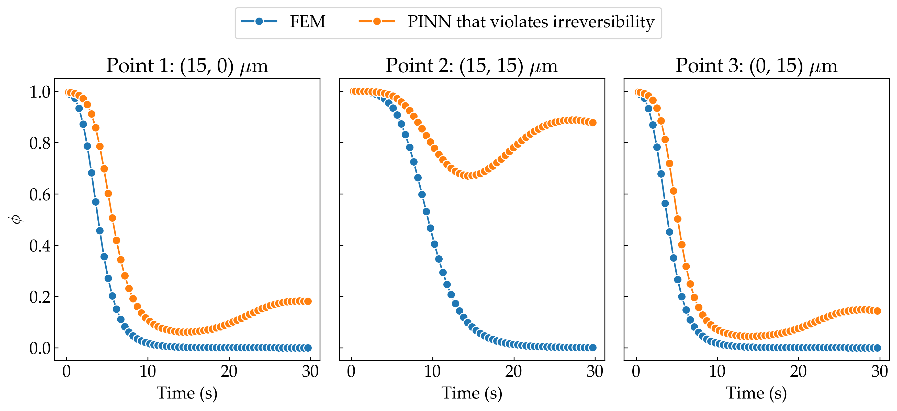

#### Temporal Irreversibility
For processes with temporal irreversibility:

**Forward irreversible processes** (where the physical quantity should only increase over time):
```python
loss_irr_t = mean(ReLU(-dphi/dt))
```

**Backward irreversible processes** (where the physical quantity should only decrease over time):
```python
loss_irr_t = mean(ReLU(dphi/dt))
```

#### Spatial Irreversibility
For processes with spatial irreversibility, such as wave propagation or diffusion-like phenomena, similar constraints can be applied.

where:
- `dphi/dt` and `dphi/dx` represent temporal and spatial derivatives of the physical quantity $\phi$
- `ReLU` activation function ensures that only violations of the irreversibility constraint contribute to the loss
- The specific form depends on the physics of the problem

This framework can be generalized to any inequality-based governing equations and multi-dimensional irreversibility constraints. The formulation significantly improves solution accuracy and stability by enforcing fundamental directionality constraints inherent in physical systems.

## Examples

We demonstrate the effectiveness of our framework through five challenging applications that showcase temporal or spatial irreversibility constraints: corrosion modeling, ice melting simulation, fracture mechanics, combustion dynamics, and traveling wave phenomena. Each example demonstrates how irreversibility constraints lead to more physically consistent and accurate solutions compared to traditional PINN approaches.

### Corrosion

The corrosion process exhibits temporal irreversibility where the corroded region can only grow over time. Our framework enforces this constraint to ensure physical consistency.


### Ice Melting

Ice melting involves irreversible phase transitions where the melting front can only advance, never retreat under constant heating conditions.


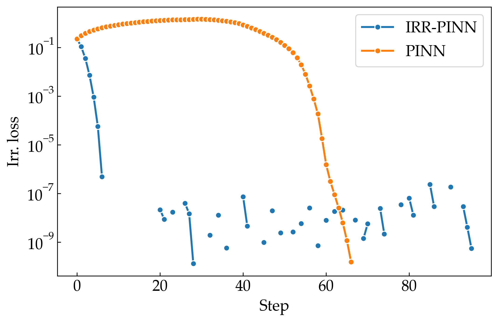

### Fracture Mechanics

Fracture propagation is inherently irreversible - once a crack forms or grows, it cannot spontaneously heal under the given loading conditions.


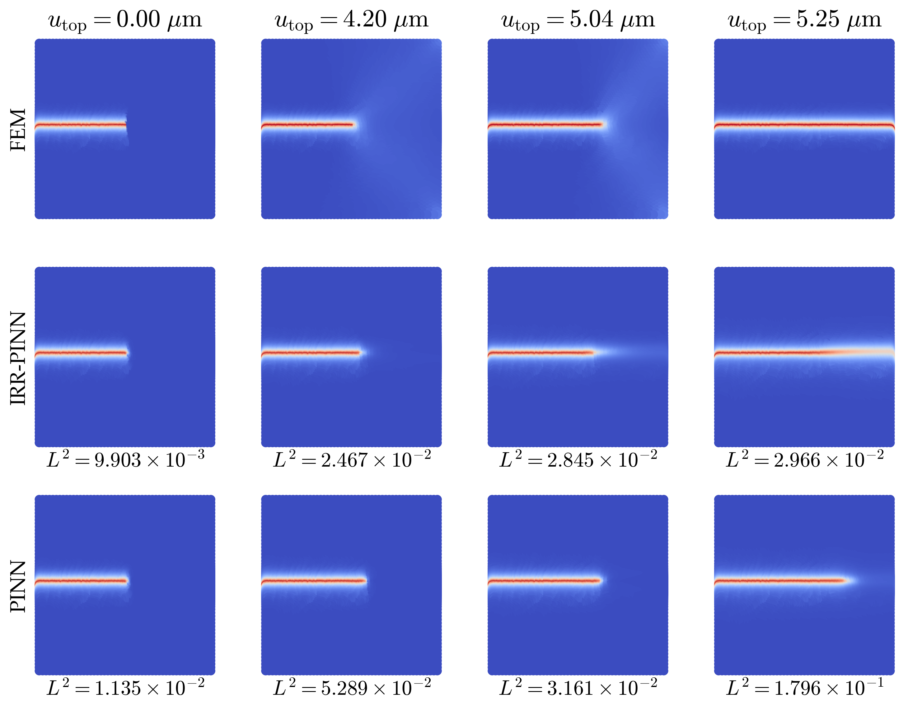

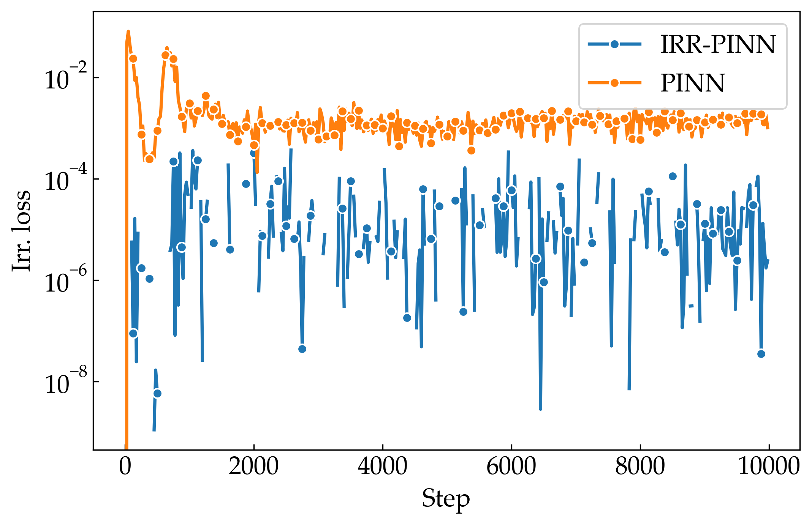

### Combustion

Combustion processes involve irreversible chemical reactions where the reaction progress can only advance in the forward direction.

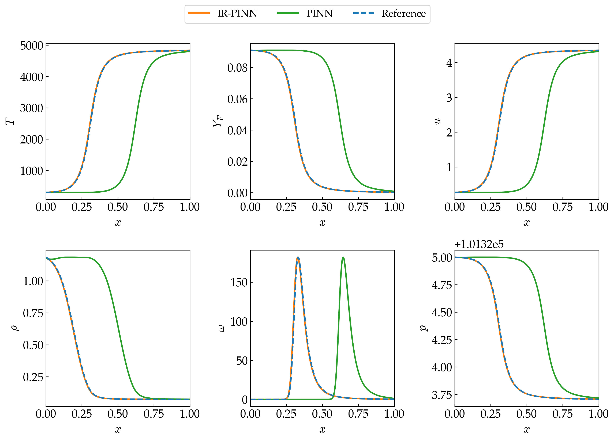
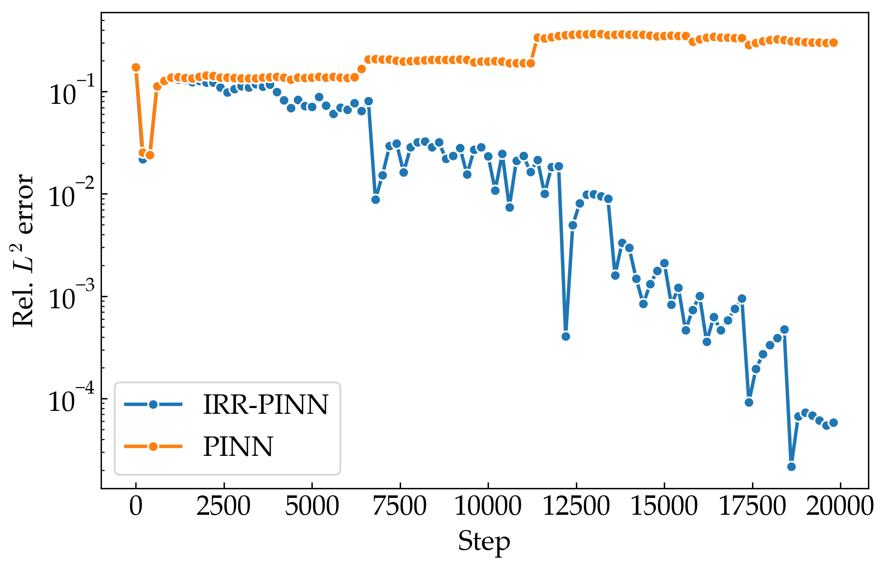
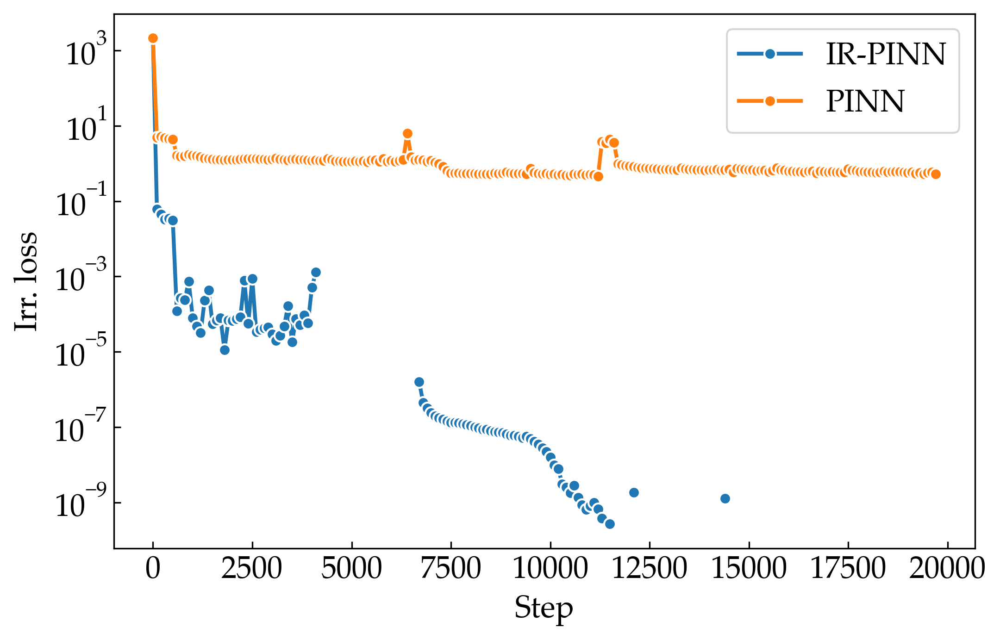

### Traveling Wave

Traveling wave phenomena, such as shock waves or solitons, exhibit spatial irreversibility where the wavefront propagates in a specific direction.

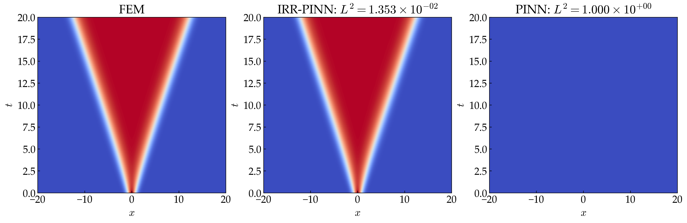
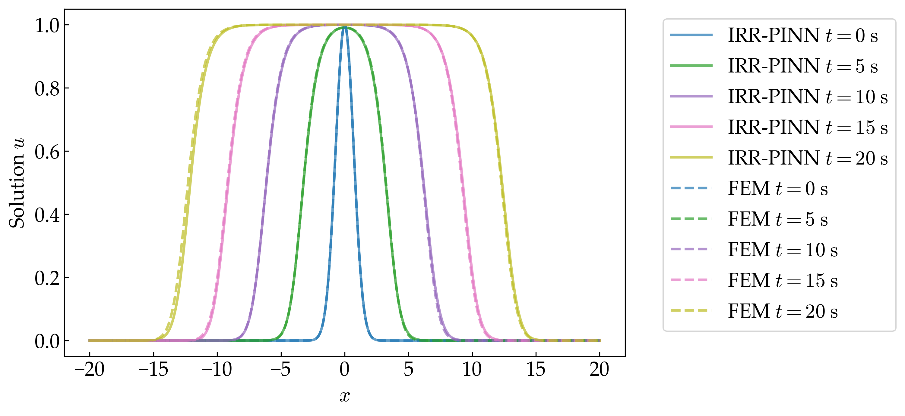

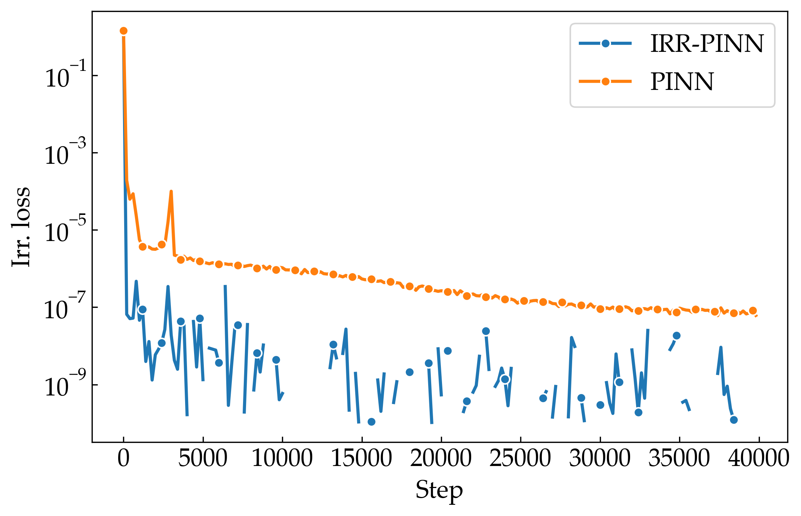

<!-- ### Fisher Equation

Fisher's equation models population dynamics and traveling wave phenomena, exhibiting both temporal irreversibility (population growth) and spatial irreversibility (wave propagation direction).

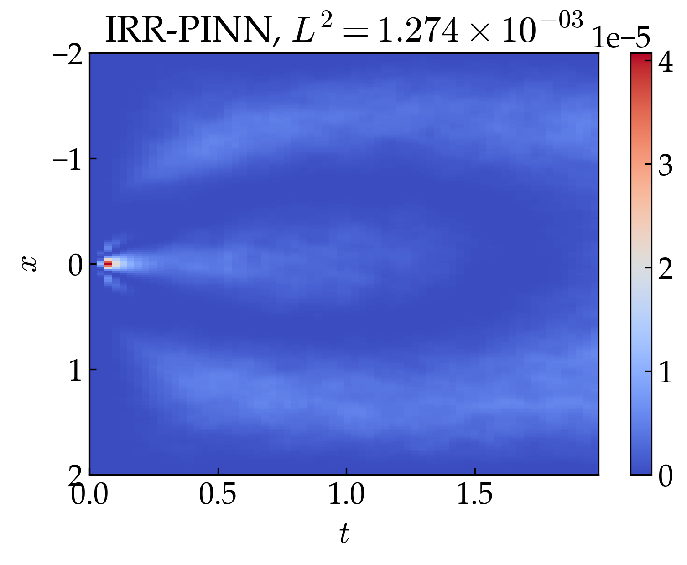
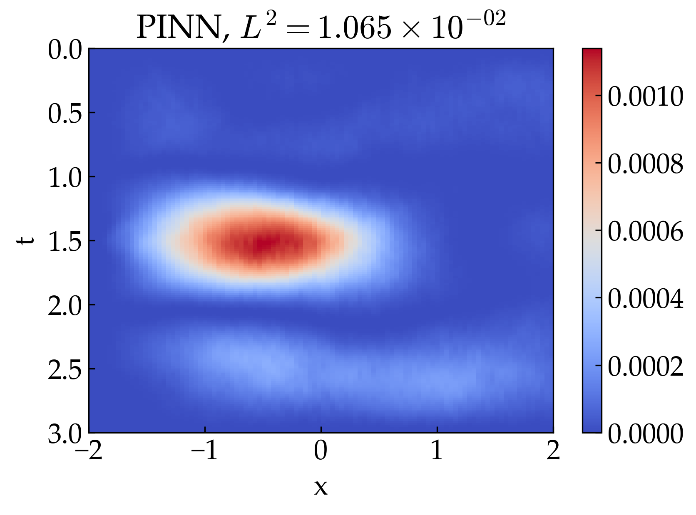
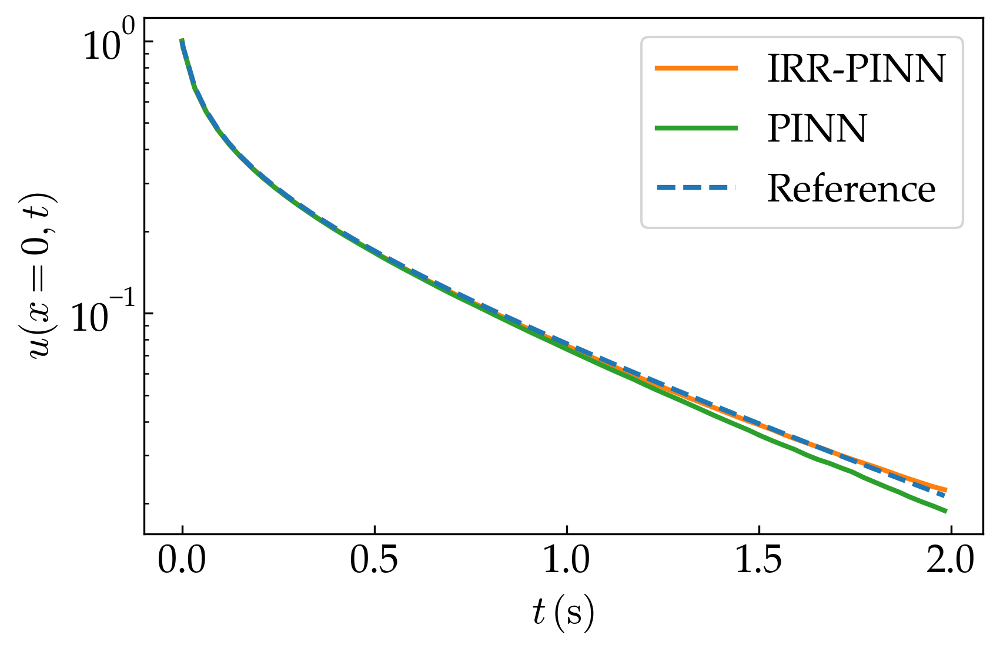
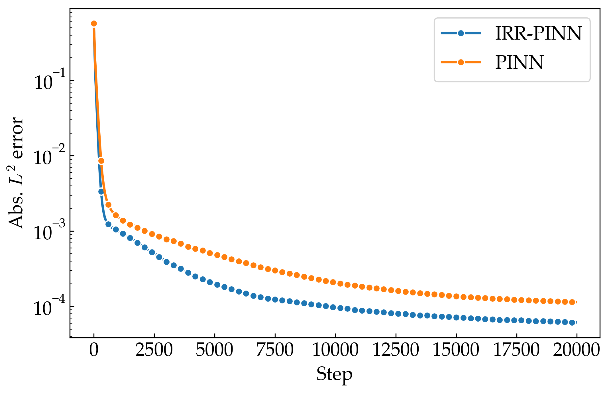
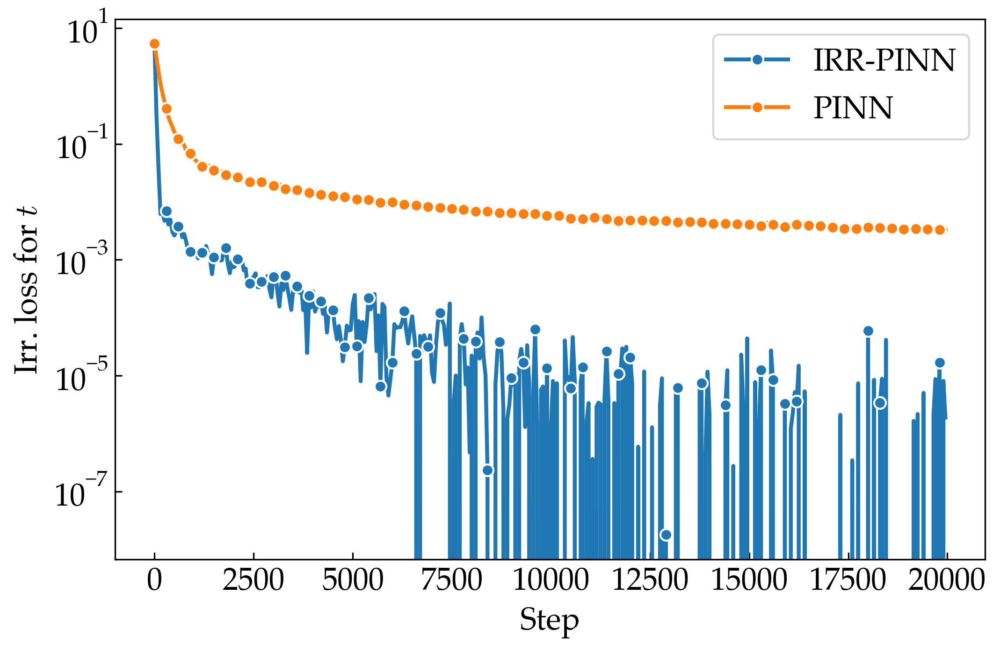
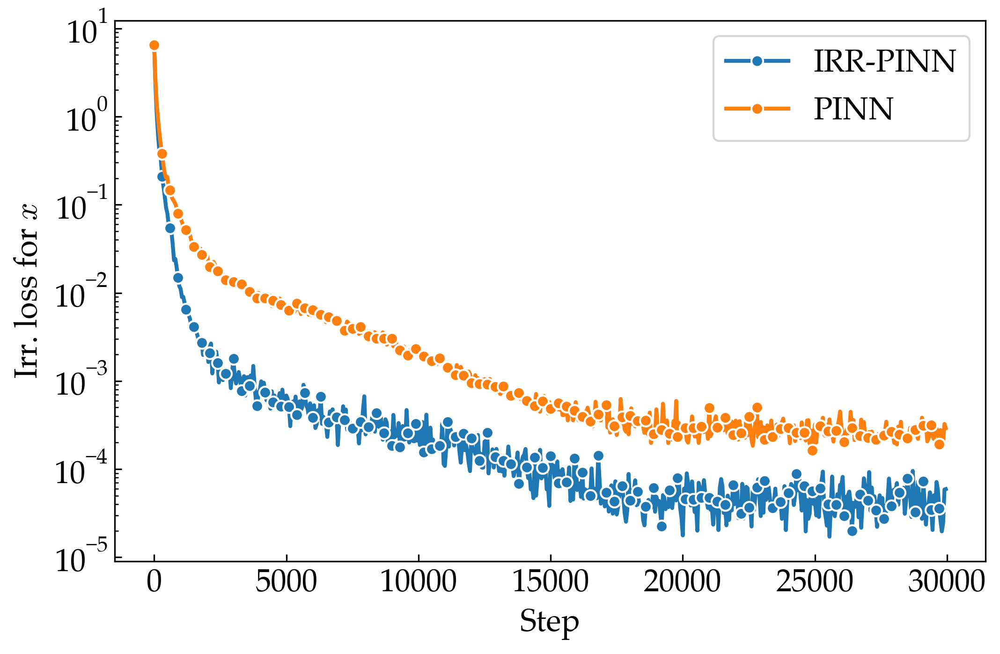 -->
