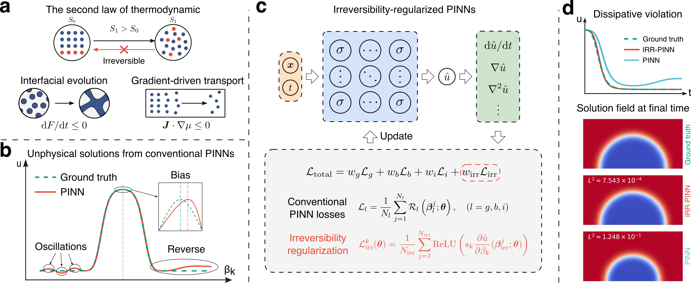

# Enforcing Hidden Physics in Physics-Informed Neural Networks

This repository contains the implementation of irreversibility-regularized physics-informed neural networks (IRR-PINNs).

Conventional PINNs can satisfy PDE residuals while still producing physically inadmissible solutions. This work addresses that gap by adding a simple regularization term that penalizes violations of irreversibility, allowing PINNs to better respect hidden physical structure with minimal changes to the standard framework.



## Main Idea

We augment the standard PINN loss with an irreversibility penalty:

```
L_total = w_g * L_g + w_b * L_b + w_i * L_i + w_irr * L_irr
```

The added term penalizes only those regions where the predicted solution violates a known one-way physical trend, such as monotonic front propagation or irreversible damage growth.

## Applications and Performance

The following table summarizes the relative errors L2 (%) achieved by our irreversibility-regularized PINNs compared to conventional baseline PINNs:

| Problem | IRR. PINN | Baseline PINN|
|---------|-------------------|-----------|
| Traveling Wave | 0.716 | 100 |
| Combustion | 0.464 | 54.9 |
| Ice Melting | 3.60 | 6.80 |
| Corrosion | 2.78 | 16.0 |
| Fracture | 2.59 | 9.22 |

*Relative errors calculated as L² norm relative to finite element method (FEM) reference solutions*

This method is simple to implement and can be added to existing PINN frameworks as a soft constraint.

## Setup

Our code is mainly based on `JAX` (Version 0.5.1) and `Flax` (Version 0.10.4) under `CUDA 12.4`. 

Install dependencies with:
```bash
pip install -r requirements.txt
```

The codebase is organized into the following directories:
- `pinn/`: Contains the core implementation of the physics-informed neural network framework, including architectures definitions, samping strategies, and causal weighting methods.
- `data/`: Contains the reference solutions generated by finite element methods (FEM) for each example problem.
- `examples/`: Contains the implementation of the five example problems.

Each example is organized in a separate subdirectory under `examples/`, containing the necessary code and configuration files to reproduce the results. To run an example, simply modify the configuration file located in `examples/<example_name>/config.py` to set the path to the reference solutions, save paths and other hyperparameters. Then, you can execute the main script for each example:
```bash
python examples/<example_name>/main.py
```

## Citation

If you find this work useful in your research, please consider citing:

```bibtex
@misc{chen2025enforcinghiddenphysicsphysicsinformed,
      title={Enforcing hidden physics in physics-informed neural networks}, 
      author={Nanxi Chen and Sifan Wang and Rujin Ma and Airong Chen and Chuanjie Cui},
      year={2025},
      eprint={2511.14348},
      archivePrefix={arXiv},
      primaryClass={cs.LG},
      url={https://arxiv.org/abs/2511.14348}, 
}
```
